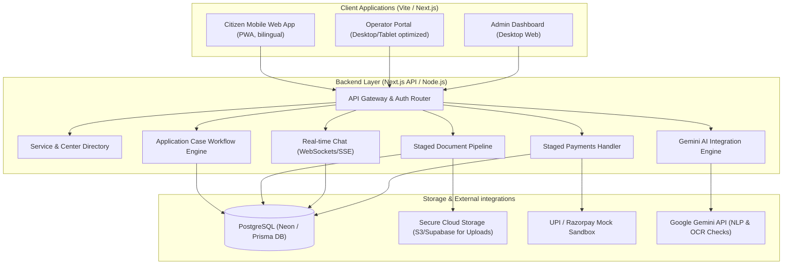
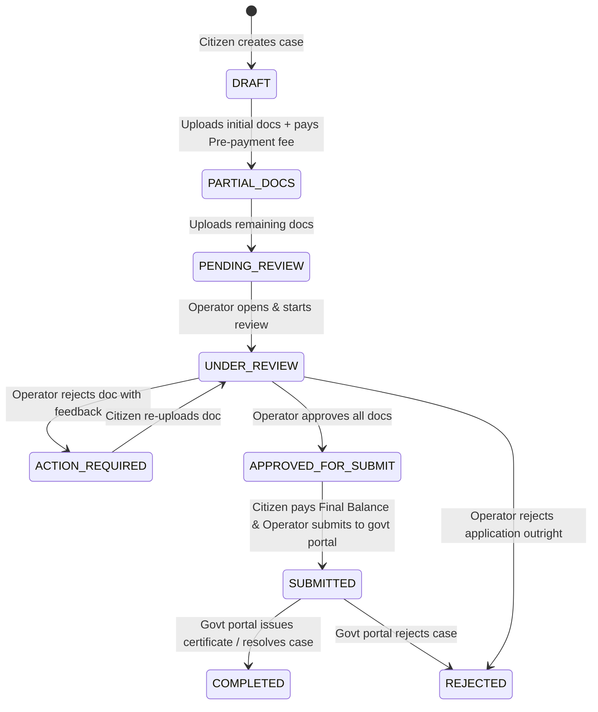

# Implementation Plan - Digital Seva App MVP

We propose the technical design, database schema, folder structure, role models, and state machine for building the rural-first **Digital Seva App** MVP. This design is built around the core goals: mobile-first citizen interface, multilingual service search (English & Telugu), staged document uploads, multi-stage payments, operator chat, and administrative controls.

## 1. Summarizing the Project (10 Lines)
1. **Core Purpose**: A rural-first digital services platform matching citizens with nearby centers to complete official applications with certainty.
2. **Citizen Value**: Reduces failed physical trips to centers by clarifying document requirements and allowing secure remote preparation.
3. **Operator Value**: Enables center operators to pre-screen documents, chat with citizens, and track application workflows.
4. **Admin Value**: Provides governance tools to manage centers, services, fee structures, and dispute resolution.
5. **Language Access**: Accessible in both English and Telugu to support rural usability.
6. **Staged Uploads**: Supports uploading documents in phases as they become available rather than requiring all at once.
7. **Staged Payments**: Integrates secure partial pre-payment for reviews and final balance settlement after validation or submission.
8. **Communication**: Provides an integrated secure chat between citizen and operator before and after payment.
9. **AI Assistant**: Assists users with service search, language queries, and document checklist validation.
10. **Aesthetics**: Premium, modern, mobile-responsive layout designed using clean HSL color palettes and Vanilla CSS.

---

## 2. System Architecture


### Components Details
* **Frontends**: A single full-stack Next.js web application using role-based routing. Styled using a cohesive Vanilla CSS design system for extreme speed, responsiveness, and premium aesthetics.
* **Backend**: Next.js Serverless API routes executing workflow business logic, serving REST endpoints, and verifying JWT/session auth.
* **AI Engine**: Gemini-powered AI Assistant for service search queries in Telugu/English and document checklist recommendations.
* **Storage**: PostgreSQL database hosted on Neon, managed with Prisma. File uploads (PDF/images) stored in S3-compatible cloud storage.
* **Chat**: Persistent chat messages stored in PostgreSQL, broadcasted in real-time via Server-Sent Events (SSE) or WebSockets.
* **Payments**: API integrations with UPI/Razorpay (mocked for MVP sandbox) configured to support staged partial/final payments.

---

## 3. Folder Structure & Key Modules

We propose the following folder structure to keep citizen, operator, and admin layers modular, yet integrated under a single Next.js project.

```
digital-seva-app/
├── public/                 # Static assets (icons, localization catalogs, banners)
├── prisma/                 # Prisma DB schema definitions and migrations
│   └── schema.prisma
├── src/
│   ├── app/                # Next.js App Router Pages
│   │   ├── (auth)/         # Logins, registrations, password resets
│   │   ├── citizen/        # Citizen mobile-first views
│   │   │   ├── search/     # Service search & center selection
│   │   │   ├── cases/      # Application workflows, doc uploads, chat
│   │   │   └── page.js     # Citizen homepage
│   │   ├── operator/       # Operator portal (desktop-friendly dashboard)
│   │   │   ├── cases/      # Client applications management, document review
│   │   │   └── page.js     # Operator homepage
│   │   ├── admin/          # Admin portal (services, payments, centers)
│   │   │   └── page.js     # Admin dashboard
│   │   ├── api/            # API backend logic
│   │   │   ├── auth/       # Session/token creation
│   │   │   ├── services/   # Search, match centers
│   │   │   ├── cases/      # Document pipeline & workflow transitions
│   │   │   ├── chat/       # Messaging system & long poll / SSE
│   │   │   ├── payments/   # Razorpay webhook / simulation endpoints
│   │   │   └── ai/         # Gemini translation/validation agent
│   │   ├── layout.js       # Global provider setups (Auth, i18n)
│   │   └── page.js         # Landing / Entry role-selector page
│   ├── components/         # Shared UI components
│   │   ├── common/         # Premium buttons, loaders, modals, layout frames
│   │   ├── citizen/        # Document upload cards, search inputs
│   │   ├── operator/       # Review panel, document status badges
│   │   └── chat/           # Chat thread, message bubble, file previews
│   ├── styles/             # Vanilla CSS Modules and Global CSS
│   │   ├── globals.css     # CSS Reset, Fonts (Outfit/Inter)
│   │   ├── theme.css       # Design tokens (HSL variables for light/dark)
│   │   └── *.module.css    # Scoped styles for component states
│   ├── lib/                # Backend & server utilities
│   │   ├── db.js           # Prisma client initializer
│   │   ├── gemini.js       # Gemini API client
│   │   ├── auth.js         # JWT signing & role parsing middleware
│   │   └── payment-mock.js # Sandbox transaction handling
│   └── hooks/              # Custom React client hooks
│       ├── useAuth.js      # Global user context hook
│       └── useChat.js      # Message listeners & pagination hooks
```

---

## 4. Main Entities & Database Schema

Here is the database model written in Prisma Schema format. It supports all critical features: localization, staged document uploads, service-center matching, and staged payments.

```prisma
datasource db {
  provider = "postgresql"
  url      = env("DATABASE_URL")
}

generator client {
  provider = "prisma-client-js"
}

enum Role {
  CITIZEN
  OPERATOR
  ADMIN
}

enum CaseStatus {
  DRAFT
  PARTIAL_DOCS          // Documents uploaded, partial payment made
  PENDING_REVIEW        // All required documents uploaded, awaiting operator review
  UNDER_REVIEW          // Operator has started verifying documents
  ACTION_REQUIRED       // Operator rejected some documents; citizen action required
  APPROVED_FOR_SUBMIT   // Review done, final balance payment needed
  SUBMITTED             // Operator submitted to official government portal
  COMPLETED             // Case finalized successfully
  REJECTED              // Case rejected by operator or govt portal
}

enum DocStatus {
  PENDING
  APPROVED
  REJECTED
}

enum PaymentType {
  PRE_PAYMENT           // Initial deposit/review fee
  FINAL_BALANCE         // Submission fee
}

enum PaymentStatus {
  PENDING
  SUCCESS
  FAILED
}

model User {
  id           String        @id @default(uuid())
  email        String?       @unique
  phone        String        @unique
  passwordHash String
  name         String
  role         Role          @default(CITIZEN)
  languagePref String        @default("en") // "en" or "te"
  createdAt    DateTime      @default(now())
  updatedAt    DateTime      @updatedAt

  // Relations
  citizenCases   ApplicationCase[] @relation("CitizenCases")
  operatorCases  ApplicationCase[] @relation("OperatorCases")
  centerStaff    OperatorCenter[]
  messagesSent   ChatMessage[]
}

model Service {
  id             String            @id @default(uuid())
  nameEn         String
  nameTe         String
  descriptionEn  String
  descriptionTe  String
  requiredDocs   Json              // Array of { nameEn: string, nameTe: string, isRequired: boolean }
  totalFee       Decimal           @db.Decimal(10, 2)
  prePaymentFee  Decimal           @db.Decimal(10, 2) // Staged payment part 1
  createdAt      DateTime          @default(now())
  cases          ApplicationCase[]
}

model ServiceCenter {
  id        String            @id @default(uuid())
  name      String
  location  String            // "lat,lng" for geo matching
  address   String
  active    Boolean           @default(true)
  createdAt DateTime          @default(now())

  operators OperatorCenter[]
  cases     ApplicationCase[]
}

model OperatorCenter {
  id         String        @id @default(uuid())
  operatorId String
  centerId   String
  operator   User          @relation(fields: [operatorId], references: [id], onDelete: Cascade)
  center     ServiceCenter @relation(fields: [centerId], references: [id], onDelete: Cascade)

  @@unique([operatorId, centerId])
}

model ApplicationCase {
  id                 String          @id @default(uuid())
  citizenId          String
  serviceId          String
  centerId           String
  operatorId         String?         // Assigneable operator
  status             CaseStatus      @default(DRAFT)
  createdAt          DateTime        @default(now())
  updatedAt          DateTime        @updatedAt

  // Relationships
  citizen            User            @relation("CitizenCases", fields: [citizenId], references: [id])
  service            Service         @relation(fields: [serviceId], references: [id])
  center             ServiceCenter   @relation(fields: [centerId], references: [id])
  operator           User?           @relation("OperatorCases", fields: [operatorId], references: [id])
  
  documents          Document[]
  chats              ChatMessage[]
  payments           Payment[]
}

model Document {
  id          String          @id @default(uuid())
  caseId      String
  name        String          // Name of the document slot (e.g. Aadhaar Card)
  fileUrl     String
  status      DocStatus       @default(PENDING)
  feedback    String?         // Rejection notes from operator
  uploadedAt  DateTime        @default(now())
  updatedAt   DateTime        @updatedAt

  applicationCase ApplicationCase @relation(fields: [caseId], references: [id], onDelete: Cascade)
}

model ChatMessage {
  id              String          @id @default(uuid())
  caseId          String
  senderId        String
  message         String
  fileUrl         String?         // Inline attachments
  createdAt       DateTime        @default(now())

  applicationCase ApplicationCase @relation(fields: [caseId], references: [id], onDelete: Cascade)
  sender          User            @relation(fields: [senderId], references: [id])
}

model Payment {
  id             String          @id @default(uuid())
  caseId         String
  amount         Decimal         @db.Decimal(10, 2)
  type           PaymentType
  status         PaymentStatus   @default(PENDING)
  transactionRef String?         // Payment gateway token
  createdAt      DateTime        @default(now())

  applicationCase ApplicationCase @relation(fields: [caseId], references: [id], onDelete: Cascade)
}
```

---

## 5. Role/Permission Matrix

| Action | Citizen | Operator | Admin |
| :--- | :---: | :---: | :---: |
| Search services (Telugu/English) | ✅ | ✅ | ✅ |
| View Service document checklists | ✅ | ✅ | ✅ |
| Locate & Select Service Centers | ✅ | ✅ | ✅ |
| Create Service Application Case | ✅ | ❌ | ❌ |
| Stage/Upload citizen documents | ✅ (Own Only) | ❌ | ❌ |
| Chat in assigned cases | ✅ (Own Only) | ✅ (Assigned Only) | ❌ |
| Make payments (Pre- / Final Balance) | ✅ (Own Only) | ❌ | ❌ |
| Update Document Status (Approve/Reject) | ❌ | ✅ (Assigned Only) | ❌ |
| Upload Supporting operator docs | ❌ | ✅ (Assigned Only) | ❌ |
| Submit application to government portal | ❌ | ✅ (Assigned Only) | ❌ |
| Manage Centers & Service configuration | ❌ | ❌ | ✅ |
| Assign Operators to Centers | ❌ | ❌ | ✅ |
| Configure Payment milestones & fee | ❌ | ❌ | ✅ |
| View global analytics and audit logs | ❌ | ❌ | ✅ |

---

## 6. Workflow State Machine

The lifetime of an `ApplicationCase` flows as follows:



---

## 7. 3-Phase Implementation Plan

We will proceed with building the application using Antigravity, testing each phase with high fidelity.

### Phase 1: Core Database, API, and Styling Engine (Weeks 1-2)
* **Goal**: Establish the DB schema, deploy local dev environment, build the styling system, and initialize core routing.
* **Tasks**:
  1. Setup Next.js boilerplate, configure Prisma, and connect to Neon PostgreSQL.
  2. Implement a responsive, premium design system in `src/styles/theme.css` and `globals.css` with a vibrant HSL color scheme (Deep Blue, Emerald, Warm Amber, Glassmorphism).
  3. Code basic authentication (JWT, multi-role middleware).
  4. Develop the Citizen home dashboard: search services in English & Telugu, list required documents, and match user coordinates to nearby Service Centers.
* **Verification**: Verify routes using Chrome DevTools MCP, run schema migrations, and write base API unit tests.

### Phase 2: Staged Document Pipeline & Communication Layer (Weeks 3-4)
* **Goal**: Implement the document upload system, payment simulator, and real-time chat.
* **Tasks**:
  1. Build the staged document upload interface (Citizen can upload partial docs, save, and return later).
  2. Implement the Mock Payment Integration API for partial pre-payment and final payment triggers.
  3. Create the Operator portal case dashboard, showing pending uploads and allowing document status approvals (`DocStatus.APPROVED`/`DocStatus.REJECTED` with feedback).
  4. Implement Case Chat (WebSockets/SSE setup) allowing real-time messaging between citizen and operator for clarifying requirements.
* **Verification**: Mock uploads using automated scripts, trace database state transitions in `ApplicationCase`, and verify the chat synchronization between Citizen and Operator views.

### Phase 3: AI Assistant, Admin Portal, and Final Polish (Weeks 5-6)
* **Goal**: Integrate the Gemini AI assistant, create administrative views, polish styling micro-animations, and prepare pilot validation.
* **Tasks**:
  1. Integrate Google Gemini API for multilingual text search parsing (Telugu semantic query translation to service matching).
  2. Configure Gemini OCR assistance to run a preliminary check on uploaded document tags (e.g., verifying if the uploaded file contains text resembling "Aadhaar" or "Voter ID").
  3. Implement the Admin Dashboard: service CRUD management, service fee settings (total vs pre-payment split), center configuration, and audit logs.
  4. Add fluid micro-animations (transitions, skeleton screens) and dark mode styling.
* **Verification**: Run comprehensive end-to-end user journey tests (Citizen registers -> searches service -> uploads docs -> pays -> chats -> Operator reviews -> approves -> submits).

---

## 8. Open Questions & Design Feedback Required

> [!IMPORTANT]
> 1. **Document Storage Hosting**: Do you have a preferred storage provider (e.g., Supabase Storage, AWS S3, or local disk uploads for the MVP stage)?
> 2. **AI Translation Approach**: Should AI assistance translate Telugu queries on-the-fly, or should we pre-translate the entire service catalog into Telugu to ensure deterministic catalog matching?
